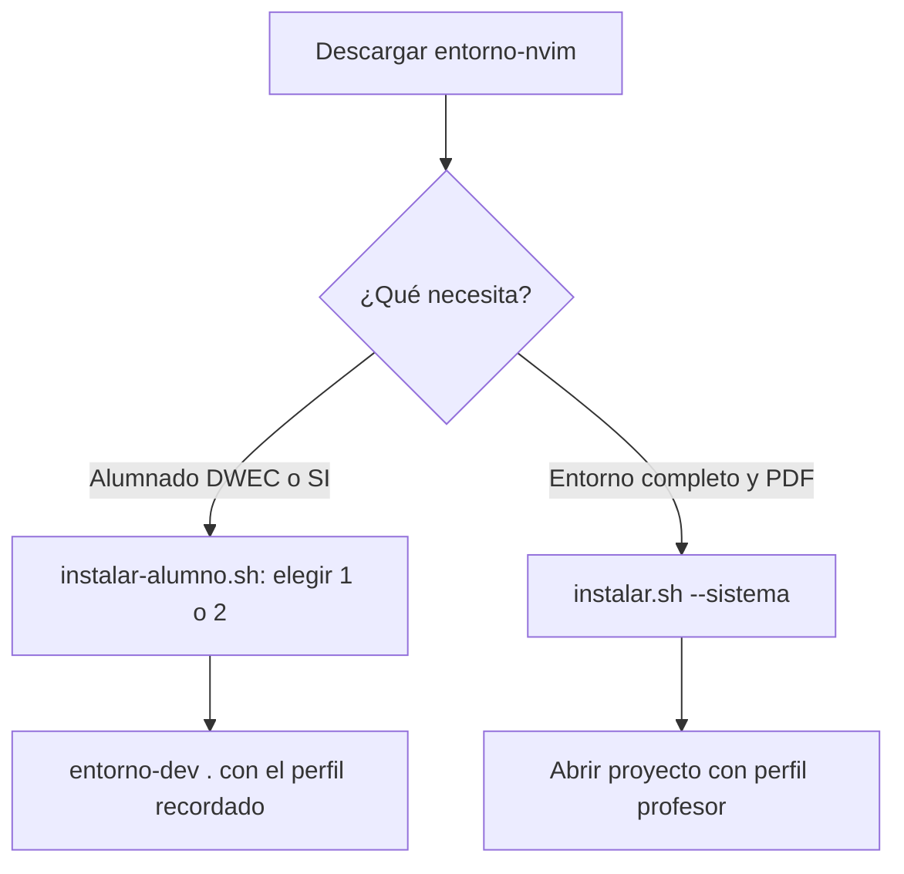

*Neovim de Isaías: desarrollo, docencia y Markdown/PDF.*

**[Guía completa de teclas y uso](docs/guia-completa-teclas.md)**: editor,
explorador, pestañas, tmux, consola, IA, PDF, autocompletado y LazyGit.

**[Chuleta para alumnado](chuleta_comandos.md)**: instalación, perfiles,
sesiones tmux, edición básica en Neovim, diagnósticos y ejecución de Bash.

**[Fragmento HTML para Moodle DWEC](docs/moodle-dwec.html)**: entrada breve con
instalación, enlaces, bloques de comandos, atajos e incidencias.

## Qué es

La evolucion docente portable ya dispone de perfiles y arranque minimo sin
dependencias opcionales. Consulte [estado y uso actual](docs/entorno-docente.md).
La V1 descrita mas abajo es la referencia historica completa en Debian;
esta fase se prueba en Omarchy y aun no certifica WSL2.

`entorno-nvim` v1.1.0 es una configuración de Neovim y tmux comprensible,
versionada y reversible para programación, docencia y documentos Markdown.
La referencia probada es Debian 13 con Neovim 0.12.4.

## Qué incluye

- Neovim modular en Lua, dashboard IFL, búsqueda, explorador y Git.
- LSP nativo para Lua, web y Python; completado nativo de Neovim 0.12.
- Tree-sitter con ocho parsers externos fijados.
- sesiones tmux por proyecto en el socket dedicado `entorno-nvim`;
- Markdown → HTML/CSS → Chromium → PDF A4 (Pandoc opcional, sólo para PDF).

El [inventario V1](docs/inventario-v1.md) detalla componentes y versiones.

## Empiece aquí: elegir la instalación

Descargue el repositorio y consulte la ayuda si tiene dudas:

```sh
git clone https://github.com/isaiasfl/entorno-nvim.git
cd entorno-nvim
./scripts/instalar.sh --help
```

**Para alumnado DWEC o SI, use el instalador de alumno. Para el entorno completo
con Markdown/PDF, use el instalador general.** Son alternativas; no necesita
ejecutar los dos.



### Comandos para instalar y abrir

Ejecute desde la carpeta del repositorio la pareja que corresponda:

| Uso | Instalar | Abrir su proyecto |
| --- | --- | --- |
| Alumnado DWEC (web) o SI (Bash y Python) | `./scripts/instalar-alumno.sh` y elegir 1 o 2 | `./bin/entorno-dev /ruta/a/mi-proyecto` |
| Profesor: entorno completo y Markdown/PDF | `./scripts/instalar.sh --sistema` | `./bin/entorno-dev --perfil profesor --sin-ia /ruta/a/mi-proyecto` |

Sustituya `/ruta/a/mi-proyecto` por la carpeta de su proyecto. Para abrir la
carpeta actual, use `.`. `--sin-ia` permite empezar con editor y terminal;
la IA es opcional y requiere un cliente ya instalado y configurado.

Antes de instalar se muestra el plan y se pide **Enter para comenzar**;
Ctrl+C cancela. La ayuda y la comprobación no inician una instalación.

### Qué significan las opciones

| Opción | Dónde se usa | Efecto |
| --- | --- | --- |
| `--yes` o `-y` | Ambos instaladores | Omite solo la pausa inicial para automatización; no autoriza sudo |
| `--help` o `-h` | Ambos instaladores | Muestra ayuda y termina sin instalar |
| `--perfil dwec` / `--perfil si` | Instalador de alumno | Elige el perfil sin preguntar; sin la opción se muestra un menú y se recuerda la elección |
| `--sistema` | Instalador general | Ofrece instalar los paquetes del sistema que falten; muestra el comando y pide confirmación antes de usar sudo |
| `--sin-sistema` | Instalador de alumno | Nunca usa sudo; solo indica qué paquetes faltan. Sin esta opción pregunta antes de instalarlos |
| `--comprobar` | Instalador de alumno | Comprueba la instalación sin descargar ni modificar |

El instalador de alumno pregunta antes de instalar paquetes del sistema que
falten; acepta `--sistema` por compatibilidad. Sin `--sistema`, el instalador
general prepara sus componentes locales y muestra cómo resolver los paquetes
del sistema que falten. El instalador general no
acepta `--perfil` ni `--comprobar`. Para comprobar requisitos generales:

```sh
./scripts/comprobar-requisitos.sh
```

### Qué cambia en su equipo

Ambas instalaciones mantienen Neovim separado: **no sustituyen
`~/.config/nvim` ni `~/.tmux.conf`**. Neovim, Node, plugins y servidores de
lenguaje se preparan dentro del repositorio. El instalador de alumno también
prepara el lanzador `entorno-dev` en `~/.local/bin`; puede usar siempre
`./bin/entorno-dev` sin depender de su PATH.

El alumnado no necesita las herramientas PDF. La instalación completa las
incluye en su flujo. Los paquetes del sistema se obtienen del gestor de la
plataforma: **Lazygit usa la versión disponible en el sistema, no descarga
necesariamente la última publicación de GitHub ni actualiza una ya instalada**.
Las versiones de los componentes locales se controlan mediante las referencias
y lockfiles del proyecto.

Para detalles y resolución de incidencias, consulte [la guía de alumnado](docs/alumno.md)
y [la instalación completa](docs/instalacion.md).

### Actualizar una instalación existente

Guarde su trabajo, entre en la carpeta de `entorno-nvim` y ejecute:

```sh
./scripts/actualizar.sh
```

Corrige archivos alterados por finales de línea de Windows, restaura
`nvim/lazy-lock.json` si cambió sin querer, ofrece cerrar las sesiones tmux
antiguas, hace `git pull --ff-only` y repite la instalación con el perfil
recordado. Para el entorno completo del profesor: `./scripts/actualizar.sh --completo`.

**Primera vez en copias anteriores a `actualizar.sh`** (descarta cambios locales
en archivos del entorno, que no deben editarse):

```sh
git restore . && git pull --ff-only && sh scripts/actualizar.sh
```

`--ff-only` solo avanza la copia hasta la versión publicada: si hubiera
cambios o commits locales que exigieran mezclar, se detiene sin tocar nada en
lugar de crear un commit de mezcla o un conflicto.

## Comprobar requisitos

```sh
./scripts/comprobar-requisitos.sh
```

Solo lee el estado y clasifica cada elemento como `OK`, `FALTA` u `OPCIONAL`.

## Usar entorno-dev desde cualquier carpeta

La instalación **no sustituye el comando `nvim` existente**. Puede empezar sin
cambiar el PATH ni la configuración habitual:

```sh
./bin/entorno-dev /ruta/a/mi-proyecto
./scripts/arrancar.sh /ruta/a/archivo
```

Ambos instaladores preparan el lanzador en `~/.local/bin`. Para una instalación
anterior o para repararlo, ejecute una sola vez desde el repositorio:

```sh
./scripts/instalar-entorno-dev.sh
```

`~/.local/bin` debe estar en su PATH. El instalador avisa si falta. En Bash/Zsh,
para la terminal actual: `export PATH="$HOME/.local/bin:$PATH"`. En Fish:
`fish_add_path "$HOME/.local/bin"`. Compruebe con `command -v entorno-dev`.

Para conservarlo en Bash/Zsh, añada `export PATH="$HOME/.local/bin:$PATH"` a
`~/.bashrc` o `~/.zshrc`, respectivamente, y abra otra terminal. Fish conserva
la ruta con `fish_add_path`. El instalador ofrece al terminar configurar el PATH permanentemente, con
confirmación separada y copia previa. `--yes` no acepta esa modificación.
Si responde que no, puede usar estas instrucciones manuales.

Después, desde la carpeta del proyecto:

```sh
entorno-dev .
```

Escribir solo `entorno-dev` usa el perfil elegido con `instalar-alumno.sh`;
si no hay ninguno, el perfil profesor.

### Usar este entorno al escribir nvim

**`activar.sh` cambia tanto el comando como la configuración habitual de
Neovim**, no solo el PATH. Crea una copia fechada y enlaza `~/.config/nvim`
y `~/.local/bin/nvim`. Es opcional; si quiere conservar Omarchy u otra
configuración, utilice los lanzadores anteriores.

Para la instalación local de Linux descrita aquí, desde el repositorio:

```sh
# Bash/Zsh: ~/.local/bin debe ir antes de las rutas del sistema.
export PATH="$HOME/.local/bin:$PATH"
ENTORNO_NVIM_TARGET="$PWD/.tools/nvim-0.12.4/bin/nvim" ./scripts/activar.sh
command -v nvim
nvim --version
```

La variable indica el binario instalado en el repositorio: el valor
predeterminado de `activar.sh` corresponde a la ubicación histórica en
`~/.local/opt`. Si usa otra ubicación o plataforma, indique la ruta real de su
binario compatible. En Fish use `fish_add_path --prepend "$HOME/.local/bin"`
y `env ENTORNO_NVIM_TARGET="$PWD/.tools/nvim-0.12.4/bin/nvim" ./scripts/activar.sh`.

El script no edita la configuración de su shell. Para conservar el PATH en
Bash/Zsh, añada la línea apropiada al archivo de inicio de su shell.
Detalles y copias en [activación](docs/activacion.md); para deshacer la
activación, consulte [restauración](docs/restauracion.md).

## Restaurar

```sh
./scripts/restaurar.sh
```

Restaura la configuración y el comando de Neovim anteriores desde el último
backup registrado. El backup histórico se conserva. Véase
[restauración](docs/restauracion.md).

## Flujo diario

```sh
cd /ruta/al/proyecto
entorno-dev --perfil dwec
```

Sin opciones recupera el perfil profesor, PDF y tmux con tres paneles.
`--sin-tmux` abre solo Neovim; `--sin-ia` omite el agente.
La [guia docente](docs/entorno-docente.md)
describe los perfiles y la [chuleta diaria](docs/chuleta.md) los atajos.
El lanzador acepta otra ruta con `entorno-dev /ruta` y abre el selector con
`entorno-dev --elegir`. Use `entorno-dev` desde cualquier carpeta. Si no se encuentra el comando,
consulte la sección de PATH anterior. `./bin/entorno-dev` es una alternativa
desde el repositorio.

## Neovim

`./scripts/arrancar.sh` ejecuta Neovim con datos, cache y estado aislados.
Conserva el runtime del escritorio y separa sus propios sockets y contextos.
No cambia la configuracion activa. [Arquitectura docente](docs/entorno-docente.md).

## tmux

El flujo usa `tmux -L entorno-nvim` y no carga ni altera `~/.tmux.conf`.
`Ctrl-a P` abre el selector de proyectos en un popup; el ratón queda disponible
como apoyo y la navegación principal sigue siendo por teclado. `Ctrl-a ?` abre
una ayuda interactiva por categorías para el flujo diario, editor, IA, espacio
de trabajo tmux, Git, terminal, navegación y configuración. Más detalles en
[terminal y tmux](docs/terminal-tmux-agentes.md).

## Agentes

El panel derecho admite agentes CLI intercambiables. `<leader>ac` pega contexto
solo tras validar el proceso de destino y nunca envía Enter. El entorno no
instala agentes ni gestiona sus credenciales.

## Markdown/PDF

`<leader>mp` genera el PDF real y `<leader>mv` lo genera y abre en el visor
externo. Cabecera y pie usan `module`, `centre` y `teacher` del YAML. Véase
[Markdown/PDF](docs/markdown-pdf.md).

## LSP

LuaLS 3.19.0, los servidores web fijados, Pyright 1.1.411 y Bash Language
Server 5.6.0 se instalan de forma aislada, sin Mason ni npm global. Véase
[LSP y completado](docs/lsp.md).

## Mappings principales

| Mapa | Acción |
| --- | --- |
| `<leader>?` / F1 en modo normal | Chuleta de teclas, errores, movimientos y snippets |
| `<leader>w` | Guardar |
| `]b` / `[b` / `:bd` | Archivo siguiente / anterior / cerrar archivo |
| `gl` / `[d` / `]d` | Errores de la línea / anterior / siguiente |
| `Ctrl-j` en insertar | Elegir o expandir snippets del lenguaje |
| `<leader>d` | Duplicar la línea actual |
| `Alt-Shift-j/k` / `Cmd-Shift-↓/↑` | Mover líneas o selecciones |
| `<leader>gg` | Lazygit |
| `<leader>mp` / `<leader>mv` | Generar PDF / generar y visualizar |
| `<leader>ac` | Pegar contexto revisable en el agente |
| `<leader>ut` | Elegir Catppuccin, Tokyo Night o Kanagawa |
| `gd`, `grr`, `grn`, `K` | Definición, referencias, rename y hover LSP |
| `Ctrl-h/j/k/l` | Navegar splits de Neovim |
| `Ctrl-a h/j/k/l` | Navegar paneles tmux |
| `Ctrl-a P` | Selector de proyectos tmux |

## Portabilidad

Probado: Debian 13 x86_64. Objetivo no probado: Arch/CachyOS x86_64 y macOS
moderno. Los scripts evitan incompatibilidades BSD evidentes, pero no se afirma
validación real fuera de Debian. Consulta [instalación V1](docs/instalacion.md).

## Seguridad

No se versionan secretos, estado de editores, credenciales ni configuraciones
privadas de agentes. El contexto hacia agentes tiene una barrera preventiva,
no un DLP. El compilador PDF solo está diseñado para Markdown propio y fiable.

## Actualización

Actualizar una versión fijada exige revisar origen, checksum o lockfile,
ejecutar `./scripts/comprobar.sh` y revisar el diff antes de confirmar. No hay
actualizaciones automáticas de plugins, parsers ni LSP.

## Desinstalación

El modo portable no requiere restaurar Neovim: no lo sustituye. Antes de
retirar el entorno, cierre sus procesos y conserve sus proyectos y documentos.
Solo quien activo la V1 mediante `activar.sh` necesita el procedimiento
historico de restauracion. El proyecto nunca borra backups automaticamente.

## Licencia

MIT © 2026 Isaías Fernández Lozano
